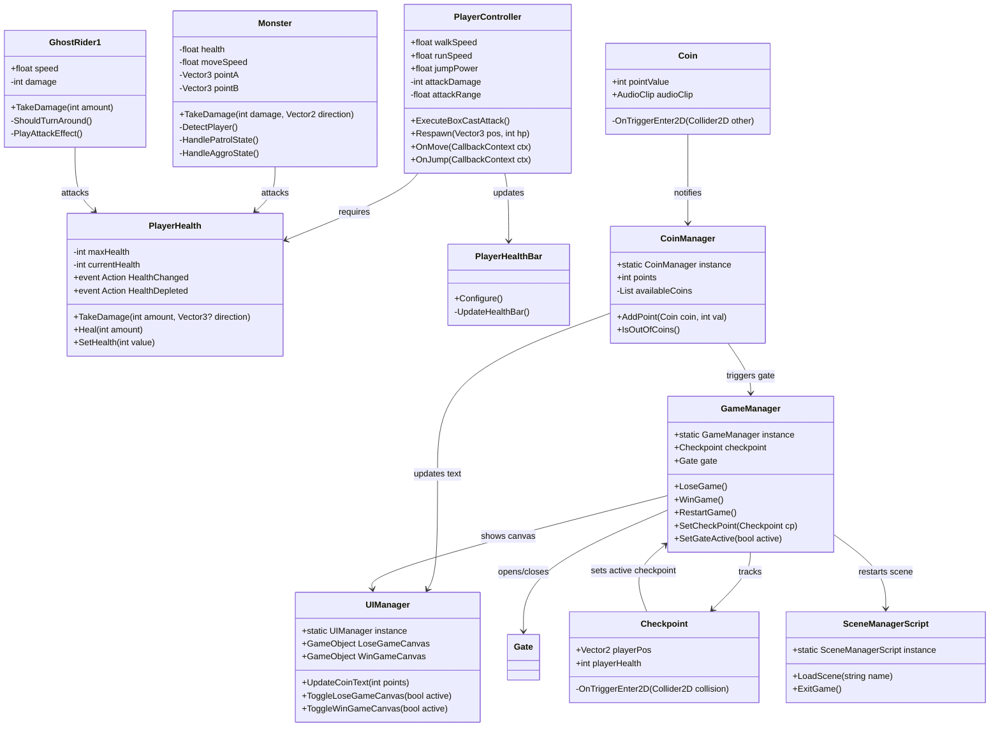

# TRƯỜNG ĐẠI HỌC FPT
## BÁO CÁO DỰ ÁN GAME: JUNGLE ESCAPE
**Môn học:** PRU212 (Lập trình Game 2D)  
**Lớp học:** SE1932-NET  
**Nhóm:** Group 4  

---

# MỤC LỤC

- [PHẦN I: GIỚI THIỆU THÀNH VIÊN NHÓM](#phần-i-giới-thiệu-thành-viên-nhóm)
- [PHẦN II: KẾ HOẠCH, PHÂN CÔNG CÁC THÀNH VIÊN](#phần-ii-kế-hoạch-phân-công-các-thành-viên)
- [PHẦN III: QUÁ TRÌNH TRIỂN KHAI](#phần-iii-quá-trình-triển-khai)
- [PHẦN IV: PHÂN TÍCH HỆ THỐNG](#phần-iv-phân-tích-hệ-thống)
- [PHẦN V: THIẾT KẾ CHI TIẾT](#phần-v-thiết-kế-chi-tiết)
- [PHẦN VI: LẬP TRÌNH (CODE)](#phần-vi-lập-trình-code)
- [PHẦN VII: KIỂM THỬ (KỊCH BẢN TEST)](#phần-vii-kiểm-thử-kịch-bản-test)
- [PHẦN VIII: KẾT QUẢ ĐẠT ĐƯỢC](#phần-viii-kết-quả-đạt-được)
- [PHẦN IX: KẾT LUẬN](#phần-ix-kết-luận)

---

# PHẦN I: GIỚI THIỆU THÀNH VIÊN NHÓM

Nhóm 4 gồm 05 thành viên lớp SE1932-NET phối hợp nghiên cứu và triển khai dự án game "Jungle Escape":

1. **Trần Đình Dương** (Trưởng nhóm / Leader)
2. **Khương Đức Anh** (Chuyên viên Thiết kế nhân vật & Tester)
3. **Nguyễn Đức Phúc** (Chuyên viên Thiết kế màn chơi & Demo)
4. **Đỗ Duy Anh** (Chuyên viên Thiết kế âm thanh & Slide)
5. **Phạm Trung Đức** (Chuyên viên Lập trình & AI)

---

# PHẦN II: KẾ HOẠCH, PHÂN CÔNG CÁC THÀNH VIÊN

### 1. Bảng phân công công việc & Đánh giá đóng góp
Để đảm bảo tiến độ và chất lượng của trò chơi, nhóm đã phân chia vai trò và nhiệm vụ cụ thể như sau:

| STT | Họ và Tên | Vai trò chính trong dự án | Nhiệm vụ chi tiết | Mức độ đóng góp | Điểm cộng đề xuất |
|:---|:---|:---|:---|:---:|:---:|
| 1 | **Trần Đình Dương** | **Leader / Core Developer** | Quản lý tiến độ, phân tích hệ thống, lập trình logic nhân vật chính (`PlayerController`), xử lý va chạm và thiết kế khung kiến trúc game. | 100% | Cộng điểm tích cực |
| 2 | **Phạm Trung Đức** | **Gameplay Developer** | Lập trình trí tuệ nhân vật quái vật (`Monster` AI), cơ chế chuyển cảnh (`SceneManagerScript`), hiệu ứng chuyển động mượt (`SpringAttack`). | 100% | Cộng điểm tích cực |
| 3 | **Nguyễn Đức Phúc** | **Level Designer** | Thiết kế bản đồ các màn chơi (Level 1, Level 2, Level 3) sử dụng Unity Tilemap, sắp xếp chướng ngại vật, bẫy chông, tiền xu và hang ẩn. | 100% | Cộng điểm tích cực |
| 4 | **Khương Đức Anh** | **Character Artist / Tester** | Tìm kiếm, tối ưu hóa sprite nhân vật và quái vật. Thiết kế animation state. Thực hiện kiểm thử toàn diện các tính năng của game. | 100% | Hoàn thành tốt |
| 5 | **Đỗ Duy Anh** | **Audio & Presentation** | Tích hợp và chỉnh sửa âm thanh (nhạc nền, tiếng chém, va chạm, chết). Thiết kế slide báo cáo và chuẩn bị kịch bản thuyết trình. | 100% | Hoàn thành tốt |

*Ghi chú: Toàn bộ thành viên tham gia tích cực đầy đủ các buổi họp và hoàn thành đúng hạn các nhiệm vụ được phân công. Không có thành viên nào vắng họp không lý do hoặc bỏ bê công việc.*

### 2. Giới thiệu về chủ đề và kịch bản chính
- **Tên game:** Jungle Escape
- **Thể loại:** 2D Adventure Platformer (Game nhập vai đi cảnh phiêu lưu 2D)
- **Nền tảng phát triển:** PC (Windows)
- **Công cụ phát triển:** Unity Engine, C# Scripting, TextMeshPro, Unity Input System mới.
- **Phong cách đồ họa:** Pixel Art cổ điển kết hợp hiệu ứng cuộn nền động Parallax Scrolling và hoạt ảnh môi trường sinh động (thác nước chảy, lá rơi, hang tối).
- **Kịch bản chính:**  
  Người chơi nhập vai một nhà thám hiểm dũng cảm bị lạc vào khu rừng rậm nguyên sinh nguy hiểm và bí ẩn. Để tìm kiếm đường thoát thân ("Escape"), anh ta phải vượt qua 3 màn chơi thử thách với địa hình hiểm trở: nhảy qua các vực sâu không đáy, tránh các cạm bẫy chông nhọn hoắt rải rác trên đường đi, đồng thời chiến đấu với sinh vật hung dữ bản địa như quái thú tuần tra và linh hồn rừng rậm (Ghost Rider).  
  Trong cuộc hành trình, người chơi cần thu thập tất cả đồng xu vàng để kích hoạt Cổng Dịch Chuyển (Gate) dẫn đến màn tiếp theo. Đồng thời, dọc đường đi có các Điểm Lưu (Checkpoint) giúp người chơi hồi sinh khi không may mất mạng, và các khu vực hang động ẩn chứa đựng nhiều phần thưởng lớn nhưng cũng đầy hiểm họa rình rập.

---

# PHẦN III: QUÁ TRÌNH TRIỂN KHAI

Nhóm đã duy trì lịch làm việc đều đặn kết hợp họp offline trên trường và làm việc online qua Discord/Google Meet để đồng bộ tiến độ.

### 1. Nhật ký các buổi họp và làm việc nhóm
- **Buổi 1 (Họp Offline - Tuần 1):**
  - *Nội dung:* Thống nhất đề tài trò chơi "Jungle Escape". Phân chia nhiệm vụ cho các thành viên. Phác thảo cơ bản các tính năng cần có.
- **Buổi 2 (Họp Online - Tuần 2):**
  - *Nội dung:* Trần Đình Dương trình bày cấu trúc mã nguồn dự kiến. Nguyễn Đức Phúc đưa ra bản thiết kế map vẽ tay sơ bộ. Khương Đức Anh giới thiệu bộ asset Pixel Art đã chọn lọc.
- **Buổi 3 (Họp Offline - Tuần 3):**
  - *Nội dung:* Lập trình di chuyển cơ bản của Player (Walk, Run, Jump). Thiết kế camera follow và hiệu ứng Parallax Scrolling nền 3 lớp.
- **Buổi 4 (Họp Online - Tuần 4):**
  - *Nội dung:* Lập trình AI cho quái vật tuần tra (Patrol AI) và đuổi theo người chơi (Chase AI). Tích hợp cơ chế chiến đấu chém kiếm và nhận sát thương (Knockback).
- **Buổi 5 (Họp Offline - Tuần 5):**
  - *Nội dung:* Xây dựng hệ thống Checkpoint lưu trạng thái, CoinManager kiểm soát số xu trên bản đồ để mở cổng. Thiết kế giao diện HUD hiển thị thanh máu và số xu.
- **Buổi 6 (Họp Online - Tuần 6):**
  - *Nội dung:* Đỗ Duy Anh tích hợp hệ thống âm thanh qua `AudioManager`. Sửa lỗi va chạm và tinh chỉnh lại độ nhạy của nút nhảy.
- **Buổi 7 (Họp Offline - Tuần 7):**
  - *Nội dung:* Khương Đức Anh và Nguyễn Đức Phúc thực hiện chạy thử kịch bản game (Playtest), ghi nhận lỗi phát sinh. Hoàn thiện tài liệu báo cáo và Slide thuyết trình.

### 2. Biên bản cuộc họp minh chứng (Trích dẫn)
- **Kênh trao đổi chính:** Discord Server Nhóm 4 - PRU212.
- **Quản lý source code:** GitHub Repository (`Dr4nkduck/JungleEscapeFantasy`).
- **Hình ảnh họp và làm việc nhóm:** *(Các thành viên đính kèm link ảnh chụp màn hình Discord hoặc ảnh chụp offline tại phòng học tự học FPT University)*.

---

# PHẦN IV: PHÂN TÍCH HỆ THỐNG

### 1. Phân tích yêu cầu chức năng (Functional Requirements)
- **Hệ thống Player:**
  - Di chuyển (Trái/Phải), chạy nhanh (Run) và nhảy cao (Jump).
  - Tấn công quái vật bằng đòn đánh cận chiến phạm vi hình hộp (BoxCast).
  - Nhận sát thương, bị giật lùi (Knockback/HitStun) và chết khi hết máu hoặc rơi xuống hố sâu (`DeadZone`).
  - Hồi sinh (`Respawn`) tại Checkpoint đã lưu.
- **Hệ thống Quái vật (AI Monster):**
  - Tuần tra tự động giữa các điểm mốc (Waypoints) được thiết lập sẵn.
  - Phát hiện người chơi bằng tia quét (Linecast) trong tầm nhìn.
  - Truy đuổi và tấn công người chơi cận chiến khi áp sát.
  - Nhận sát thương từ người chơi, bị choáng (Stun) và biến mất khỏi bản đồ khi chết.
- **Hệ thống Thu thập & Cửa ải:**
  - Nhặt tiền xu (Coins) cộng điểm và phát âm thanh tương ứng.
  - Khi thu thập toàn bộ xu trên màn chơi, Cổng Dịch Chuyển (`Gate`) sẽ tự động mở ra để người chơi đi qua màn mới.
- **Hệ thống Giao diện UI/UX:**
  - Màn hình Menu chính (Chơi game, Thoát).
  - Thanh máu HUD hiển thị trực quan phần trăm máu còn lại.
  - Màn hình kết quả (Win Game Canvas khi qua màn, Lose Game Canvas khi tử nạn để chọn Restart/Menu).

### 2. Giả thuật / Lưu đồ thuật toán (Flowchart) của các chức năng chính

#### A. Thuật toán di chuyển & Nhận sát thương của người chơi (Player Controller Logic)
```
[Bắt đầu Update]
       │
       ├─► [Đọc dữ liệu nút di chuyển từ New Input System]
       │         │
       │         └─► Cập nhật tốc độ di chuyển x (Walk hoặc Run)
       │
       ├─► [Kiểm tra phím Tấn công (Chuột trái)]
       │         │
       │         └─► Nếu ngoài thời gian Cooldown:
       │                   Kích hoạt Attack Animation -> Tạo BoxCast kiểm tra va chạm Enemy
       │                   -> Trừ máu Enemy -> Thực hiện SpringMovement di chuyển lướt nhẹ
       │
       ├─► [Kiểm tra Vực sâu (Fall Threshold)]
       │         │
       │         └─► Nếu vị trí Y < fallThreshold:
       │                   Gán Máu Player = 0 -> Kích hoạt Chết -> Hiện Lose Screen
       └─► [Hết vòng lặp Update]
```

#### B. Thuật toán AI Quái vật tuần tra & Đuổi bắt (Monster Patrol & Chase AI)
```
[Bắt đầu Update Quái Vật]
       │
       ├─► [Quét Linecast tìm Player trong tầm nhìn]
       │         │
       │         ├─► Có phát hiện Player?
       │         │         │
       │         │         ├─► Khoảng cách <= Tầm đánh (Attack Range)
       │         │         │         └─► Dừng di chuyển -> Thực hiện đòn đánh (gây sát thương lên Player) -> Bắt đầu Cooldown
       │         │         │
       │         │         └─► Khoảng cách > Tầm đánh
       │         │                   └─► Chuyển sang trạng thái Đuổi theo (Chase) hướng về phía Player
       │         │
       │         └─► Không phát hiện Player?
       │                   └─► Tiếp tục Tuần tra (Patrol) qua lại giữa Waypoint A và Waypoint B
       │                             Đến điểm mốc -> Dừng lại chờ (WaitTime) -> Quay đầu -> Di chuyển tiếp
       │
       └─► [Hết vòng lặp]
```

---

# PHẦN V: THIẾT KẾ CHI TIẾT

### 1. Kiến trúc hệ thống và Sơ đồ lớp (Class Diagram)
Game được xây dựng theo mô hình **Component-Based Architecture** của Unity kết hợp mẫu thiết kế **Singleton Pattern** để quản lý trạng thái chung. Dưới đây là sơ đồ mối quan hệ giữa các lớp cốt lõi trong trò chơi:



### 2. Thiết kế Cảnh (Scene) và Quản lý Lớp (Layer)
- **Danh sách Cảnh (Scenes):**
  1. `Menu`: Màn hình giới thiệu trò chơi, nút Start để chơi và Exit để thoát.
  2. `GameplayScene` / `Level1`: Màn chơi nhập môn. Người chơi làm quen với cơ chế nhảy cơ bản, tránh chông nhọn và quái tuần tra đơn giản.
  3. `Level2`: Mức độ trung bình. Bản đồ dài hơn, xuất hiện GhostRider bay lơ lửng bám đuổi và địa hình chông rải rác nhiều hơn.
  4. `Level3`: Thử thách cực hạn. Đòi hỏi kỹ năng điều khiển chính xác, nhiều hang ẩn khuất và quái vật đông đảo bảo vệ tiền xu.
- **Phân bổ Layer vật lý trong Unity:**
  - `Default`: Các thành phần môi trường tĩnh.
  - `Ground`: Lớp đất đá có thể đi trên đó (dùng để quét Raycast kiểm tra chạm đất - Grounded Check).
  - `Player`: Nhân vật chính của người chơi.
  - `Enemy`: Chứa quái vật `Monster` và `GhostRider1` để Player quét tia chém.
  - `IgnorePlayer`: Lớp đặc biệt gán cho quái vật sau khi chết để người chơi có thể đi xuyên qua mà không bị cản lại vật lý.

---

# PHẦN VI: LẬP TRÌNH (CODE)

### 1. Quy chuẩn lập trình (Coding Convention)
Dự án tuân thủ nghiêm ngặt quy chuẩn code C# của Microsoft dành cho Unity:
- **PascalCase** cho tên Class, Interface, Method, Properties (Ví dụ: `PlayerController`, `TakeDamage`, `CurrentHealth`).
- **camelCase** cho các biến cục bộ và đối số hàm (Ví dụ: `moveInput`, `damageValue`).
- Các biến private/protected được đặt tên rõ nghĩa, tránh viết tắt bừa bãi (Ví dụ: dùng `isAttacking` thay vì `isAtk`).
- Sử dụng **Early Returns** để giảm độ sâu của các khối lệnh lồng nhau, giúp mã nguồn sạch và dễ bảo trì.
- Các Class tương tác với UI hoặc màn chơi được thiết kế dạng **Singleton Pattern** để có thể dễ dàng truy xuất từ bất cứ đâu.

### 2. Một số hàm tiêu biểu và giải thích mã nguồn

#### A. Cơ chế chém diện rộng BoxCast của Player (`PlayerController.cs`)
Hàm thực hiện quét một vùng hình hộp ở phía trước mặt Player để phát hiện các đối tượng thuộc lớp quái vật (`enemyLayer`) và gây sát thương.

```csharp
/// <summary>
/// Thực hiện quét vùng BoxCast phía trước mặt nhân vật để phát hiện và gây sát thương cho quái vật
/// </summary>
public void ExecuteBoxCastAttack()
{
    // Xác định hướng đang đứng của người chơi để quét đúng phía trước mặt
    float directionSign = IsFacingRight ? 1f : -1f;
    Vector2 attackOrigin = (Vector2)transform.position + new Vector2(attackRange * directionSign, 0f);

    // Phát hiện tất cả các Collider thuộc lớp kẻ địch nằm trong vùng hình hộp
    RaycastHit2D[] hits = Physics2D.BoxCastAll(attackOrigin, attackBoxSize, 0f, Vector2.zero, 0f, enemyLayer);

    // Duyệt qua từng kẻ địch bị đánh trúng và áp sát thương
    foreach (RaycastHit2D hit in hits)
    {
        Monster monster = hit.collider.GetComponent<Monster>();
        if (monster == null)
        {
            // Dự phòng trường hợp script gắn ở component cha
            monster = hit.collider.GetComponentInParent<Monster>();
        }

        if (monster != null && !monster.IsDead)
        {
            // Trừ máu và truyền hướng lực đánh để quái bị giật lùi (Knockback)
            monster.TakeDamage(attackDamage, IsFacingRight ? Vector2.right : Vector2.left);
        }
    }
}
```

#### B. Cơ chế Hồi sinh tại Checkpoint (`PlayerController.cs` & `GameManager.cs`)
Khi người chơi bị hết máu hoặc rơi xuống hố tử thần, hệ thống sẽ gọi hàm `Respawn` để đặt lại trạng thái nhân vật tại tọa độ Checkpoint gần nhất mà không cần tải lại toàn bộ cảnh.

```csharp
/// <summary>
/// Đưa người chơi trở lại vị trí lưu của Checkpoint với lượng máu tương ứng
/// </summary>
/// <param name="position">Tọa độ hồi sinh được lưu</param>
/// <param name="health">Lượng máu người chơi có tại thời điểm kích hoạt Checkpoint</param>
public void Respawn(Vector3 position, int health)
{
    // Đặt lại tọa độ nhân vật
    transform.position = position;

    // Reset lại vận tốc vật lý về 0 tránh quán tính từ mạng trước
    if (rb != null)
    {
        rb.linearVelocity = Vector2.zero;
    }

    // Mở khóa các trạng thái điều khiển
    canMove = true;
    isAttacking = false;
    isHit = false;

    // Đặt lại lượng máu
    if (playerHealth != null)
    {
        playerHealth.SetHealth(health);
    }

    // Kích hoạt lại collider vật lý của nhân vật
    if (bodyCollider != null)
    {
        bodyCollider.enabled = true;
    }

    // Đồng bộ lại hoạt ảnh trạng thái đứng yên
    UpdateAnimationState();
}
```

#### C. Lập trình AI Quái vật (`Monster.cs` - Vòng lặp AI chính)
Quái vật chạy cập nhật trạng thái trong `Update` để quyết định xem nên tuần tra hay tấn công/đuổi bắt.

```csharp
private void Update()
{
    // Nếu quái đã chết hoặc đang bị choáng do nhận đòn đánh thì không thực hiện logic AI
    if (IsDead || isStunned) return;

    // Quét tia Linecast xem có Player trong vùng tầm nhìn không
    Transform player = DetectPlayer();

    if (player != null)
    {
        // Nếu phát hiện thấy Player, hủy bỏ trạng thái chờ tuần tra nếu có
        if (isWaiting)
        {
            InterruptActiveState();
            isWaiting = false;
        }
        // Tập trung đuổi theo hoặc tấn công người chơi
        HandleAggroState(player);
    }
    else if (!isAttacking && !isWaiting)
    {
        // Nếu không thấy Player, quay lại hành vi tuần tra bình thường giữa 2 điểm mốc
        HandlePatrolState();
    }
}
```

### 3. Cơ chế mở rộng mã nguồn (Extensibility)
Hệ thống sử dụng cơ chế **Event-Driven (Hướng sự kiện)** thông qua lớp `PlayerHealth.cs`. Nhờ việc khai báo các sự kiện C# Action như `HealthChanged`, `DamageTaken` và `HealthDepleted`, các script khác như UI hiển thị thanh máu (`PlayerHealthBar`), âm thanh (`AudioManager`) và bộ điều khiển (`PlayerController`) có thể đăng ký lắng nghe thay đổi máu của thực thể mà không cần can thiệp trực tiếp vào mã nguồn tính toán máu. Điều này giúp dễ dàng tạo thêm các loại kẻ địch mới hoặc bổ sung các tính năng nâng cấp máu về sau mà không lo xảy ra lỗi liên đới hệ thống.

---

# PHẦN VII: KIỂM THỬ (KỊCH BẢN TEST)

### 1. Bảng kịch bản kiểm thử (Test Cases)

| Mã Lỗi / TC | Chức năng kiểm thử | Các bước thực hiện | Kết quả mong đợi | Trạng thái thực tế |
|:---:|:---|:---|:---|:---:|
| **TC01** | Di chuyển của nhân vật | Nhấn các phím mũi tên Trái/Phải hoặc A/D; nhấn Shift để chạy nhanh. | Nhân vật di chuyển mượt mà, chuyển đổi hoạt ảnh đi bộ sang chạy và lật mặt Sprite tương ứng. | Đạt |
| **TC02** | Nhảy của nhân vật | Nhấn nút Jump (Spacebar) khi đang đứng trên mặt đất. | Nhân vật nhảy lên, phát hoạt ảnh nhảy. Không thể nhảy liên tục khi đang ở trên không (No double-jump). | Đạt |
| **TC03** | Tấn công kẻ địch | Nhấp chuột trái khi kẻ địch nằm trong phạm vi hiển thị Gizmos màu đỏ. | Player phát hiệu ứng chém, kẻ địch phát âm thanh trúng đòn, giật lùi (Knockback) và bị trừ máu tương ứng. | Đạt |
| **TC04** | Nhận sát thương & Chết | Đi qua chông sắt (`Spike`) hoặc để quái vật áp sát chém. | Máu người chơi giảm trên HUD, bị đẩy lùi nhẹ. Nếu máu về 0 hoặc rơi xuống vực sâu (`DeadZone`), nhân vật chết, hiện màn hình Lose. | Đạt |
| **TC05** | Lưu điểm Checkpoint | Di chuyển chạm vào đối tượng Checkpoint trên bản đồ. | Checkpoint chuyển màu trắng, phát âm thanh lưu điểm, lưu tọa độ và lượng máu hiện tại của người chơi. | Đạt |
| **TC06** | Hồi sinh tại Checkpoint | Bấm nút "Restart" trên màn hình Lose sau khi đã đi qua Checkpoint. | Nhân vật hồi sinh ngay tại tọa độ Checkpoint đã lưu, máu hồi phục về mức tại thời điểm lưu. | Đạt |
| **TC07** | Ăn xu & Mở cổng thắng | Thu thập toàn bộ các đồng xu vàng rải rác trên bản đồ màn chơi. | Đồng xu biến mất, điểm trên HUD tăng. Khi không còn đồng xu nào, Cổng dịch chuyển xuất hiện/kích hoạt để đi tiếp. | Đạt |

### 2. Kịch bản Demo thực tế (Demo Script)
1. **Bước 1:** Khởi động game từ scene `Menu`, bấm nút "Play" để vào màn chơi thứ nhất.
2. **Bước 2:** Di chuyển Player sang phải nhặt 3 đồng xu đầu tiên, kiểm tra xem điểm HUD có tăng từ 0 lên 3 hay không.
3. **Bước 3:** Nhảy qua bẫy chông đầu tiên. Cố ý chạm nhẹ vào chông để kiểm tra xem máu có tụt đi 10 điểm và thanh máu HUD có thu ngắn lại hay không.
4. **Bước 4:** Tiếp cận cột mốc Checkpoint thứ nhất, lá cờ đổi màu báo hiệu kích hoạt thành công.
5. **Bước 5:** Đối đầu với một quái vật tuần tra (`Monster`). Nhấp chuột trái để chém 4 phát tiêu diệt quái, nhặt thêm đồng xu quái bảo vệ.
6. **Bước 6:** Nhảy hụt chân rơi xuống hố vực sâu. Nhân vật biến mất, âm thanh tử trận phát ra và màn hình Lose Game hiện lên.
7. **Bước 7:** Bấm chọn "Restart" trên màn hình Lose Game. Xác nhận nhân vật xuất hiện lại ngay vị trí Checkpoint ở Bước 4 với lượng máu nguyên vẹn.
8. **Bước 8:** Hoàn thành nhặt các đồng xu còn lại. Đi thẳng vào Cổng Gate vừa phát sáng để chuyển sang Màn tiếp theo.

---

# PHẦN VIII: KẾT QUẢ ĐẠT ĐƯỢC

Dự án đã phát triển thành công trò chơi "Jungle Escape" hoàn chỉnh với các kết quả cụ thể:
- Xây dựng hoàn chỉnh **03 màn chơi** (Level 1, Level 2, Level 3) với độ khó tăng dần và cấu trúc bản đồ đa dạng.
- Triển khai thành công **02 loại kẻ địch** với AI thông minh: Quái thú đi bộ tuần tra mặt đất và Bóng ma bay lơ lửng bám đuổi người chơi xuyên địa hình.
- Tích hợp đầy đủ các hiệu ứng hình ảnh (Parallax Scrolling, thác nước động) mang lại trải nghiệm thị giác ấn tượng, mượt mà.
- Hệ thống âm thanh sống động khớp với các hành động của nhân vật chính và quái vật.

### Ảnh chụp giao diện màn hình game (Screenshots)
*(Thành viên nhóm có thể chèn các hình ảnh thực tế của game vào các vị trí dưới đây để minh họa)*:
- **Giao diện Menu chính:** Thiết kế tối giản, hiện đại với hiệu ứng mờ sương rừng sâu.
- **HUD trong game:** Hiển thị thanh HP màu đỏ nổi bật và bộ đếm tiền xu tinh tế ở góc trái màn hình.
- **Màn chơi Level 1:** Toàn cảnh địa hình rừng xanh mướt, hệ thống dây leo và vực thẳm.
- **Màn hình Game Over / Game Victory:** Thiết kế retro bóng bẩy, mang lại cảm xúc phấn khích cho người chơi.

---

# PHẦN IX: KẾT LUẬN

### 1. Ưu điểm
- **Tinh thần làm việc nhóm:** Nhóm 4 đã phối hợp cực kỳ nhịp nhàng. Việc phân công công việc dựa theo thế mạnh của từng người giúp tối ưu hóa hiệu suất và chất lượng các module game.
- **Kiến trúc code chuẩn mực:** Source code được viết rõ ràng, phân cấp thư mục khoa học, áp dụng các design pattern thông dụng giúp trò chơi chạy rất ổn định và dễ sửa lỗi.
- **Cơ chế gameplay tốt:** Trải nghiệm điều khiển nhân vật nhảy, chém, lực đẩy lùi (Knockback) cho cảm giác tương tác vật lý chân thực và phản hồi tốt.

### 2. Hạn chế
- **Tài nguyên đồ họa:** Do giới hạn về thời gian và nhân lực tự thiết kế, nhóm phải sử dụng một số tài nguyên đồ họa pixel miễn phí có sẵn trên mạng dẫn đến phong cách art đôi chỗ chưa hoàn toàn đồng nhất.
- **Tính năng lưu trữ:** Game chưa tích hợp cơ chế lưu màn chơi lâu dài (Save Game vào bộ nhớ máy) khi tắt hẳn trò chơi đi, người chơi sẽ phải đi lại từ đầu nếu thoát ứng dụng.

### 3. Bài học kinh nghiệm rút ra
- Nắm vững quy trình quản lý dự án phần mềm bằng Git/GitHub, giải quyết tốt các xung đột mã nguồn (Merge conflicts) khi nhiều người cùng commit code.
- Hiểu sâu sắc cách thức hoạt động của vòng đời Unity (`Update`, `FixedUpdate`, `Awake`, `Start`) và cách tối ưu hóa hiệu năng bằng cách giảm thiểu các hàm tìm kiếm đối tượng liên tục (`FindObjectsByType`).
- Kỹ năng thiết kế màn chơi (Level Design) đòi hỏi tư duy logic cao để sắp xếp thử thách hợp lý, mang lại trải nghiệm thú vị mà không gây ức chế cho người chơi.
